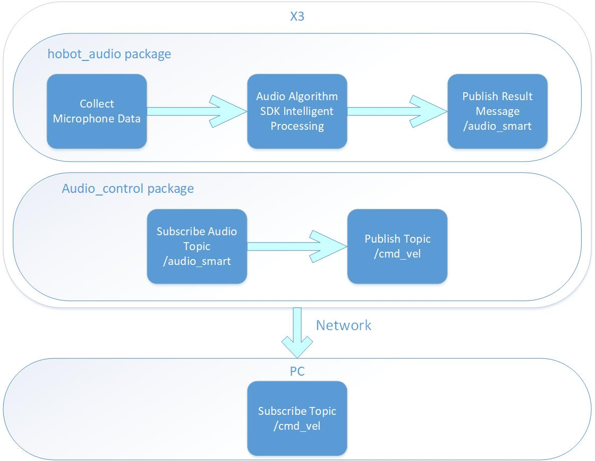
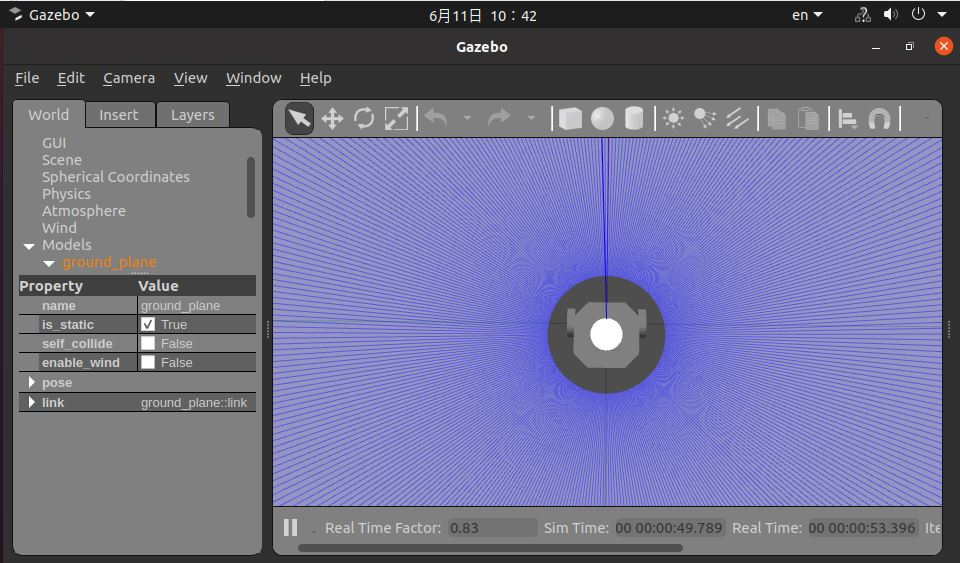

English| [简体中文](./README_cn.md)

# Feature Introduction

Voice-controlled car motion function controls the robot to move forward, backward, left, and right through voice commands, requiring the use of the intelligent voice module of the D-Robotics Robot Operating System. When the user speaks the command to control the robot's movement, the intelligent voice module recognizes the command, and then issues the motion command to the robot for movement.

The process is as shown in the diagram below:



This application can be used to simulate the operation of a virtual car in the Gazebo simulation environment on the PC side, and can also be directly used to control physical cars.

# Physical Robots

## Bill of Materials

The following robots are all compatible with RDK X3

| Robot Name          | Manufacturer | Reference Link                                                                                      |
| :------------------ | ------------ | --------------------------------------------------------------------------------------------------- |
| OriginBot Smart Robot | GUYUEJU     | [Click here](https://www.originbot.org/)                                                            |
| X3 Paibot           | Wheel Fun Technology | [Click here](https://item.taobao.com/item.htm?spm=a230r.1.14.17.55e556912LPGGx&id=676436236906&ns=1&abbucket=12#detail) |
| Tracked Smart Car    | Waveshare Electronic | [Click here](https://detail.tmall.com/item.htm?abbucket=9&id=696078152772&rn=4d81bea40d392509d4a5153fb2c65a35&spm=a1z10.5-b-s.w4011-22714387486.159.12d33742lJtqRk) |
| RDK X3 Robot         | Yabo Intelligent | [Click here](https://detail.tmall.com/item.htm?id=726857243156&scene=taobao_shop&spm=a1z10.1-b-s.w5003-22651379998.21.421044e12Yqrjm) |
| Microphone Board     | Waveshare Electronic | [Click here](https://www.waveshare.net/shop/Audio-Driver-HAT.htm) |

## Instructions for Use

### Preparation

1. The robot is equipped with a motion chassis, camera, circular microphone board, and RDK kit. The hardware is connected and tested;
2. The ROS low-level driver is available, the robot can receive the "/cmd_vel" command to move, and can move correctly according to the command.

### Robot Assembly

The following operation process is based on the OriginBot, and the methods for other robots meeting the conditions are similar. Refer to the [usage guide](https://www.originbot.org/guide/quick_guide/) on the robot's official website to complete the hardware assembly, image burning, and example operation of the robot, confirming that the basic functions of the robot can run smoothly.

### Package Installation

**1. Refer to [OriginBot instructions](https://github.com/nodehubs/originbot_minimal/blob/develop/README.md) to complete the installation of Originbot basic functions**

**2. Install the package**

After starting the robot, connect to the robot via SSH or VNC through the terminal, copy and run the following command on the RDK system to install the related Nodes.

tros foxy:
```bash
sudo apt update
sudo apt install -y tros-audio-control
```

tros humble:
```bash
sudo apt update
sudo apt install -y tros-humble-audio-control
```

### Running Voice-controlled Car Motion Function

**1. Start the robot base**

Start the robot with the following command for OriginBot:

tros foxy:
```bash
source /opt/tros/setup.bash
ros2 launch originbot_base robot.launch.py
```

tros humble:
```bash
source /opt/tros/humble/setup.bash
ros2 launch originbot_base robot.launch.py
```

**2. Start voice control**

Start a new terminal and launch the function with the following commands:

tros foxy:
```shell
# Set up the tros.n environment
source /opt/tros/setup.bash

# Copy the configuration files required for running examples from the RDK installation path.
cp -r /opt/tros/${TROS_DISTRO}/lib/hobot_audio/config/ .

# Suppress debug printing information
export GLOG_minloglevel=3

# Launch the launch file
ros2 launch audio_control audio_control.launch.py
```

tros humble:
```shell
# Set up the tros.b humble environment
source /opt/tros/humble/setup.bash

# Copy the configuration files required for running examples from the RDK installation path.
cp -r /opt/tros/${TROS_DISTRO}/lib/hobot_audio/config/ .

# Suppress debug printing information
export GLOG_minloglevel=3

# Launch the launch file
ros2 launch audio_control audio_control.launch.py
```

After successful startup, when the user says commands like "*go forward*" "*move backward*" "*turn left*" "*turn right*" "*stop moving*", the robot will start moving according to the commands.

**3. Results Analysis**

The RDK terminal output during operation provides the following information:

```shell
    This is audio control package.

============================================
    audio control usage

Wake up device is "Hello Horizon".
Audio control command word definitions are:
    "go forward": move front.
    "move backward": move back.
    "rotate right": rotate robot to right.
    "rotate left": rotate robot to left.
============================================
```

The above log snippet captures the output of the audio control package after startup. The log content indicates that the wake-up word configured for this voice control module is "Hello Horizon", and the command words for controlling the robot's movement are: "go forward", "move backward", "turn left", "turn right".

# Gazebo Simulation

Gazebo simulation is suitable for developers who have RDK X3 but do not have a physical robot to experience its functions.

## Bill of Materials

| Robot Name | Manufacturer | Reference Link                                                 |
| :--------- | ------------ | -------------------------------------------------------------- |
| RDK X3     | Multiple     | [Click here](https://developer.d-robotics.cc/rdkx3)              |
| Microphone Board   | Waveshare | [Click here](https://www.waveshare.net/shop/Audio-Driver-HAT.htm) |

## Instructions

### Preparation

1. Developers have the physical RDK kit and the corresponding microphone board.
2. The ROS Gazebo and Turtlebot robot-related function packages have been installed on the PC.
3. The PC is on the same network segment as the RDK (wired or connected to the same wireless network, the first three segments of the IP address must be consistent). The required environment for the PC includes:

tros foxy:
- Ubuntu 20.04 system

- [ROS2 Foxy Desktop version](https://docs.ros.org/en/foxy/Installation/Ubuntu-Install-Debians.html)

- Gazebo and Turtlebot3 related function packages, installation method:

   ```shell
   sudo apt-get install ros-foxy-gazebo-*
   sudo apt install ros-foxy-turtlebot3
   sudo apt install ros-foxy-turtlebot3-simulations
   ```

tros humble:
- Ubuntu 22.04 system

- [ROS2 Humble Desktop version](https://docs.ros.org/en/humble/Installation/Ubuntu-Install-Debians.html)

- Gazebo and Turtlebot3 related function packages, installation method:

   ```shell
   sudo apt-get install ros-humble-gazebo-*
   sudo apt install ros-humble-turtlebot3
   sudo apt install ros-humble-turtlebot3-simulations
   ```


### Package Installation

After starting RDK X3, connect to the robot via SSH or VNC from the terminal and run the following commands on the RDK system to install the related nodes.

tros foxy:
```bash
sudo apt update
sudo apt install -y tros-audio-control
```

tros humble:
```bash
sudo apt update
sudo apt install -y tros-humble-audio-control
```

### Running Functions

**1. Start Simulation Environment and Robot**

   On the PC's Ubuntu terminal, use the following commands to start Gazebo and load the robot model:

tros foxy:
```shell
source /opt/ros/foxy/setup.bash
export TURTLEBOT3_MODEL=burger
```
tros humble:
```shell
source /opt/ros/humble/setup.bash
export TURTLEBOT3_MODEL=burger
```

```
ros2 launch turtlebot3_gazebo empty_world.launch.py
```

Upon successful launch, the simulated car in the environment looks as follows:



**2. Start Voice Control**

Launch a new terminal and start the functionality with the following commands:

tros foxy:
```shell
# Set up tros.n environment
source /opt/tros/setup.bash

# Copy the required configuration files from the installation path of RDK
cp -r /opt/tros/${TROS_DISTRO}/lib/hobot_audio/config/ .

# Disable debug print information
export GLOG_minloglevel=3

# Launch the launch file
ros2 launch audio_control audio_control.launch.py
```

tros humble:
```shell
# Set up tros.b humble environment
source /opt/tros/humble/setup.bash

# Copy the required configuration files from the installation path of RDK
cp -r /opt/tros/${TROS_DISTRO}/lib/hobot_audio/config/ .

# Disable debug print information
export GLOG_minloglevel=3

# Launch the launch file
ros2 launch audio_control audio_control.launch.py
```

Upon successful launch, when the user speaks commands such as "*move forward*", "*move backward*", "*turn left*", "*turn right*", "*stop moving*", the car will start moving according to the commands.

Voice-controlled car movement in the simulation environment on the PC looks like this:


# Interface Description

## Topics

| Name     | Message Type            | Description                                     |
| -------- | ----------------------- | ----------------------------------------------- |
| /cmd_vel | geometry_msgs/msg/Twist | Publish velocity commands to control the robot |

## Parameters

| Parameter Name          | Type         | Description                                                                                                | Required | Supported Configuration                                                             | Default Value |
| ----------------------- | ------------ | ---------------------------------------------------------------------------------------------------------- | -------- | ----------------------------------------------------------------------------------- | -------------- |
| ai_msg_sub_topic_name   | std::string  | Topic subscribing to audio smart frame messages                                                             | No       | Configurable based on the actual situation                                                 | /audio_smart  |
| twist_pub_topic_name    | std::string  | Topic name for publishing Twist type motion control messages                                                 | No       | Configurable based on the deployment environment. Generally, robots subscribe to /cmd_vel | /cmd_vel      |
| move_step               | float        | Step length for translation movement, unit: meters                                                           | No       | No limitations                                                                        | 0.5           |
| rotate_step             | float        | Step length for rotation movement, unit: radians                                                           | No       | No limitations                                                                        | 0.5           |
| motion_duration_seconds | int          | Duration for translation/rotation actions in seconds. Values less than or equal to 0 indicate no limits, and a stop command will be issued after the specified duration to prevent continuous movement of the robot. | No       | No limitations                                                                        | 0             |

# References
## Frequently Asked Questions

1. Error when running startup command on Ubuntu `-bash: ros2: command not found`

   The current terminal is not set up with ROS2 environment. Execute the following command to set up the environment:

   tros foxy:
   ```bash
   source /opt/tros/setup.bash
   ```

   tros humble:
   ```bash
   source /opt/tros/humble/setup.bash
   ```

   Execute the `ros2` command in the current terminal to confirm if the environment is active:

   ```shell
   # ros2
   usage: ros2 [-h] Call `ros2 <command> -h` for more detailed usage. ...

   ros2 is an extensible command-line tool for ROS 2.

   optional arguments:
   -h, --help            show this help message and exit
   ```

   If the above information is displayed, it means the ros2 environment configuration is successful.

   Note: For each new terminal opened, ROS2 environment needs to be set up again.

2. Unable to open audio device

   - Confirm if the audio device is properly connected
   - Confirm if the audio device is configured correctly
   - Confirm if there were any audio devices connected before loading the audio driver
